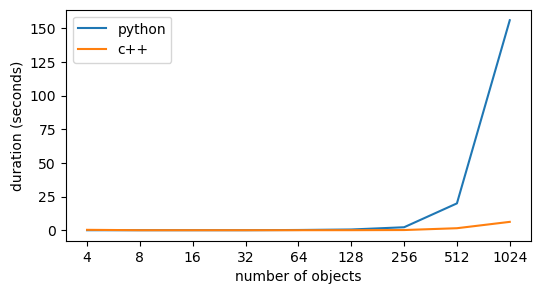

# tripletMatrixDistance

This tool allows you to compute efficiently a measure of dissimilarity between 2 dissimilarity matrices, assumed to be symmetric. This measure uses a criterion of triplet ranking preservation to quantify dissimilarity, and is bounded between 0 and 1.

The algorithm is as follows:
 - for every triplet of objects
    - count 1 if the ordering of the triplet is the same on both matrix
 - divide by the total number of triplet

This measure has a lot of advantages compared to other means of comparison. Unfortunately, complexity is O(Nˆ3).

While the python implementation quickly becomes intractable when the number of objects goes above 1000, the c implementation remains quite reasonable.

Both implementations are monocore.

Here are some benchmarks done using a 3,3 GHz Intel Core i5:

### TODO:
 - add multi-core implementations